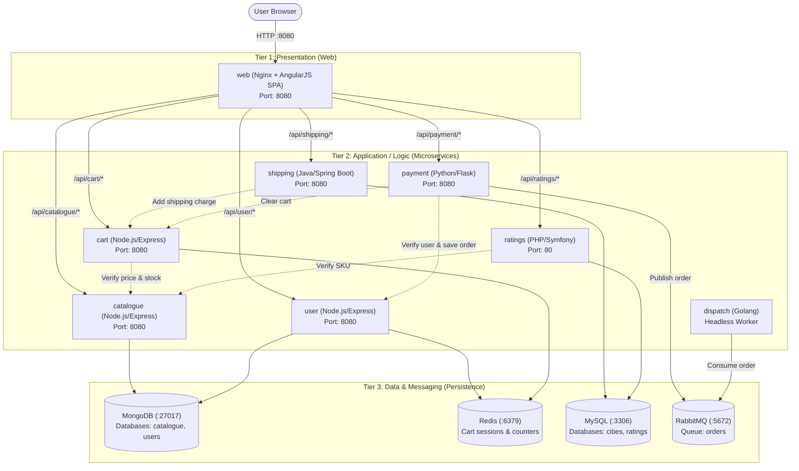

# Three-Tier E-Commerce Architecture Microservices

This repository contains the standalone source code for **Stan's Robot Shop**, a polyglot microservices e-commerce application structured in a classic **Three-Tier Architecture**.

---

## Architecture Overview

---

## Microservices Directory & Documentation

Click on any microservice below to see its dedicated documentation, architecture diagram, dependencies, and local run/test commands:

| Microservice | Tier | Stack | Primary Role | Documentation |
| :--- | :--- | :--- | :--- | :--- |
| **[web](file:///Users/ariansar/Downloads/EKS-Three-Tier/three-tier-architecture-demo/web)** | Tier 1 (Presentation) | Nginx, AngularJS | Storefront SPA & API Reverse Proxy | [web/README.md](file:///Users/ariansar/Downloads/EKS-Three-Tier/three-tier-architecture-demo/web/README.md) |
| **[catalogue](file:///Users/ariansar/Downloads/EKS-Three-Tier/three-tier-architecture-demo/catalogue)** | Tier 2 (Application) | Node.js, Express | Product listings, categories, and search | [catalogue/README.md](file:///Users/ariansar/Downloads/EKS-Three-Tier/three-tier-architecture-demo/catalogue/README.md) |
| **[user](file:///Users/ariansar/Downloads/EKS-Three-Tier/three-tier-architecture-demo/user)** | Tier 2 (Application) | Node.js, Express | Authentication, user profiles, and order history | [user/README.md](file:///Users/ariansar/Downloads/EKS-Three-Tier/three-tier-architecture-demo/user/README.md) |
| **[cart](file:///Users/ariansar/Downloads/EKS-Three-Tier/three-tier-architecture-demo/cart)** | Tier 2 (Application) | Node.js, Express | In-flight shopping carts & Prometheus metrics | [cart/README.md](file:///Users/ariansar/Downloads/EKS-Three-Tier/three-tier-architecture-demo/cart/README.md) |
| **[shipping](file:///Users/ariansar/Downloads/EKS-Three-Tier/three-tier-architecture-demo/shipping)** | Tier 2 (Application) | Java 8, Spring Boot | Distance and delivery cost calculations | [shipping/README.md](file:///Users/ariansar/Downloads/EKS-Three-Tier/three-tier-architecture-demo/shipping/README.md) |
| **[ratings](file:///Users/ariansar/Downloads/EKS-Three-Tier/three-tier-architecture-demo/ratings)** | Tier 2 (Application) | PHP 7.4, Symfony | Product star ratings and reviews | [ratings/README.md](file:///Users/ariansar/Downloads/EKS-Three-Tier/three-tier-architecture-demo/ratings/README.md) |
| **[payment](file:///Users/ariansar/Downloads/EKS-Three-Tier/three-tier-architecture-demo/payment)** | Tier 2 (Application) | Python 3.9, Flask | Order checkout & payment gateway processing | [payment/README.md](file:///Users/ariansar/Downloads/EKS-Three-Tier/three-tier-architecture-demo/payment/README.md) |
| **[dispatch](file:///Users/ariansar/Downloads/EKS-Three-Tier/three-tier-architecture-demo/dispatch)** | Tier 2 (Application) | Go (Golang) | Background queue consumer for order fulfillment | [dispatch/README.md](file:///Users/ariansar/Downloads/EKS-Three-Tier/three-tier-architecture-demo/dispatch/README.md) |
| **[mongo](file:///Users/ariansar/Downloads/EKS-Three-Tier/three-tier-architecture-demo/mongo)** | Tier 3 (Data) | MongoDB 5 | Document store for catalogue & user data | [mongo/README.md](file:///Users/ariansar/Downloads/EKS-Three-Tier/three-tier-architecture-demo/mongo/README.md) |
| **[mysql](file:///Users/ariansar/Downloads/EKS-Three-Tier/three-tier-architecture-demo/mysql)** | Tier 3 (Data) | MySQL 5.7 | Relational store for cities & product ratings | [mysql/README.md](file:///Users/ariansar/Downloads/EKS-Three-Tier/three-tier-architecture-demo/mysql/README.md) |

---

## Inter-Service Communication Matrix

| Source Service | Target Service | Protocol | Port | Purpose |
| :--- | :--- | :--- | :--- | :--- |
| `web` | `catalogue`, `user`, `cart`, `shipping`, `payment`, `ratings` | HTTP | 8080 / 80 | Client traffic reverse-proxying |
| `cart` | `catalogue` | HTTP | 8080 | Look up unit price, existence, and stock availability |
| `cart` | `redis` | RESP | 6379 | Store active cart JSON |
| `shipping` | `cart` | HTTP | 8080 | Inject calculated shipping fee (`sku: 'SHIP'`) |
| `shipping` | `mysql` | JDBC | 3306 | Query `cities` coordinate database |
| `ratings` | `catalogue` | HTTP | 8080 | Check that SKU exists before saving rating |
| `ratings` | `mysql` | PDO | 3306 | Read and write product ratings |
| `payment` | `user` | HTTP | 8080 | Verify user and append order to history |
| `payment` | `cart` | HTTP | 8080 | Verify valid total/shipping and empty cart |
| `payment` | `rabbitmq` | AMQP | 5672 | Publish order event to `orders` queue |
| `dispatch` | `rabbitmq` | AMQP | 5672 | Consume order events from `orders` queue |
