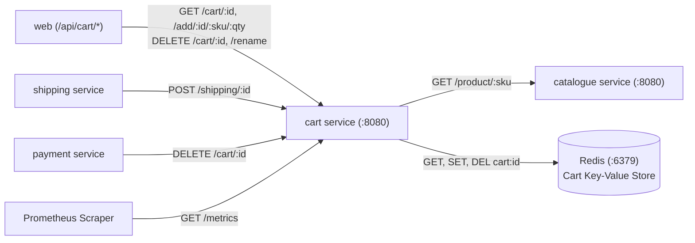

# Cart Microservice

The **Cart** microservice manages in-flight customer shopping carts. It stores cart data as JSON documents in Redis, talks to the Catalogue service to validate item availability and pricing, and exposes Prometheus metrics.

---

## Architecture & Service Connections

The Cart service is in the Application Tier (Tier 2). It interacts directly with Redis for session persistence and calls Catalogue over HTTP to verify product availability and pricing.



---

## Upstream & Downstream Dependencies

| Connection | Direction | Protocol | Description |
| :--- | :--- | :--- | :--- |
| **`web`** | Inbound | HTTP / REST | Handles cart creation, item additions, quantity modifications, and deletions |
| **`shipping`** | Inbound | HTTP / REST | Injects calculated shipping cost item (`sku: 'SHIP'`) into cart |
| **`payment`** | Inbound | HTTP / REST | Deletes cart upon successful order checkout |
| **`catalogue`** | Outbound | HTTP / REST | Verifies product existence, unit price, and stock levels before adding |
| **`redis`** | Outbound | Redis RESP Protocol | Key-value store holding cart JSON records indexed by cart ID |

---

## Environment Variables

| Variable | Default Value | Description |
| :--- | :--- | :--- |
| `REDIS_HOST` | `redis` | Hostname/DNS of the Redis instance |
| `CATALOGUE_HOST` | `catalogue` | Hostname/DNS of the Catalogue service |
| `CART_SERVER_PORT` | `8080` | Port for the Express server to listen on |

---

## How to Run Locally

### 1. Start Backing Services (Redis & Catalogue)
```bash
# 1. Run Redis
docker run -d --name redis -p 6379:6379 redis:6.2-alpine

# 2. (Optional) Run Catalogue if you want real product lookups
docker run -d --name catalogue -p 8081:8080 -e MONGO_URL=mongodb://host.docker.internal:27017/catalogue rs-catalogue
```

### 2. Option A: Run Natively with Node.js
*Requirements: Node.js 14+ and npm*

```bash
# 1. Install dependencies
npm install

# 2. Start the service
REDIS_HOST=localhost CATALOGUE_HOST=localhost npm start
```

### 3. Option B: Run with Docker
```bash
# 1. Build Docker image
docker build -t rs-cart .

# 2. Run container
docker run -d --name cart -p 8080:8080 \
  -e REDIS_HOST=host.docker.internal \
  -e CATALOGUE_HOST=host.docker.internal \
  rs-cart
```

---

## How to Test & Verify

1. **Health Check Endpoint**:
   ```bash
   curl -s http://localhost:8080/health
   ```
   **Expected Output:**
   ```json
   {"app":"OK","redis":true}
   ```

2. **Prometheus Metrics**:
   ```bash
   curl -s http://localhost:8080/metrics
   ```
   **Expected Output:** Prometheus metrics exposition format including `items_added`.

3. **Add Product to Cart**:
   *(Requires Catalogue service running with SKU `Watson`)*
   ```bash
   curl -s http://localhost:8080/add/cart-123/Watson/2
   ```
   **Expected Output:**
   ```json
   {
     "total": 4002,
     "tax": 800.4,
     "items": [
       {"qty": 2, "sku": "Watson", "name": "Watson", "price": 2001, "subtotal": 4002}
     ]
   }
   ```

4. **Retrieve Cart**:
   ```bash
   curl -s http://localhost:8080/cart/cart-123
   ```

5. **Delete Cart**:
   ```bash
   curl -s -X DELETE http://localhost:8080/cart/cart-123
   ```
   **Expected Output:** `OK`
