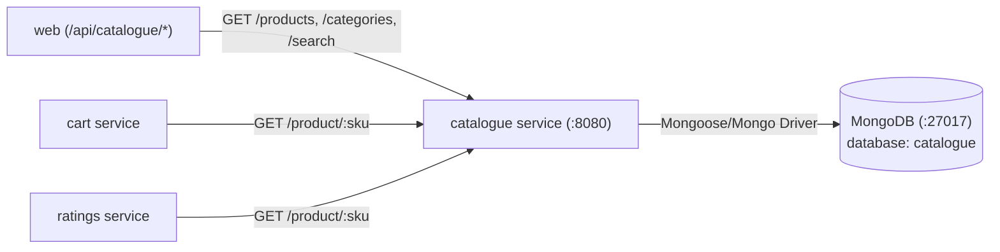

# Catalogue Microservice

The **Catalogue** microservice manages the product inventory, product categories, and search capabilities for Stan's Robot Shop. It is a Node.js (Express) application that connects to MongoDB to query catalog data.

---

## Architecture & Service Connections

The Catalogue service sits in the Application Tier (Tier 2). It is called by the Web reverse proxy, the Cart service (to validate SKU prices and stock availability), and the Ratings service (to verify SKU validity before accepting a rating).



---

## Upstream & Downstream Dependencies

| Connection | Direction | Protocol | Description |
| :--- | :--- | :--- | :--- |
| **`web`** | Inbound | HTTP / REST | Proxies storefront requests to browse items |
| **`cart`** | Inbound | HTTP / REST | Verifies product existence, unit price, and stock count |
| **`ratings`** | Inbound | HTTP / REST | Verifies product SKU before accepting user reviews |
| **`mongodb`** | Outbound | MongoDB Wire Protocol | Primary database containing `products` collection |

---

## Environment Variables

| Variable | Default Value | Description |
| :--- | :--- | :--- |
| `MONGO_URL` | `mongodb://mongodb:27017/catalogue` | MongoDB connection connection string |
| `CATALOGUE_SERVER_PORT` | `8080` | Port for the Express server to listen on |
| `GO_SLOW` | `0` | Optional millisecond delay to simulate database latency on SKU lookups |

---

## How to Run Locally

### 1. Start Backing Database (MongoDB)
The catalogue service requires MongoDB seeded with catalog data:
```bash
# Run MongoDB with pre-populated catalogue data from the mongo directory
docker run -d --name mongodb -p 27017:27017 -v $(pwd)/../mongo:/docker-entrypoint-initdb.d mongo:5
```

### 2. Option A: Run Natively with Node.js
*Requirements: Node.js 14+ and npm*

```bash
# 1. Install dependencies
npm install

# 2. Start the service (pointing to localhost MongoDB)
MONGO_URL=mongodb://localhost:27017/catalogue npm start
```

### 3. Option B: Run with Docker
```bash
# 1. Build the Docker image
docker build -t rs-catalogue .

# 2. Run container connected to host's MongoDB
docker run -d --name catalogue -p 8080:8080 -e MONGO_URL=mongodb://host.docker.internal:27017/catalogue rs-catalogue
```

---

## How to Test & Verify

1. **Health Check Endpoint**:
   ```bash
   curl -s http://localhost:8080/health
   ```
   **Expected Output:**
   ```json
   {"app":"OK","mongo":true}
   ```

2. **List All Categories**:
   ```bash
   curl -s http://localhost:8080/categories
   ```
   **Expected Output:**
   ```json
   ["Artificial Intelligence","Robot"]
   ```

3. **Fetch Product by SKU**:
   ```bash
   curl -s http://localhost:8080/product/Watson
   ```
   **Expected Output:**
   ```json
   {
     "sku": "Watson",
     "name": "Watson",
     "description": "Probably the smartest AI on the planet",
     "price": 2001,
     "instock": 2,
     "categories": ["Artificial Intelligence"]
   }
   ```

4. **Search Products**:
   ```bash
   curl -s http://localhost:8080/search/droid
   ```
