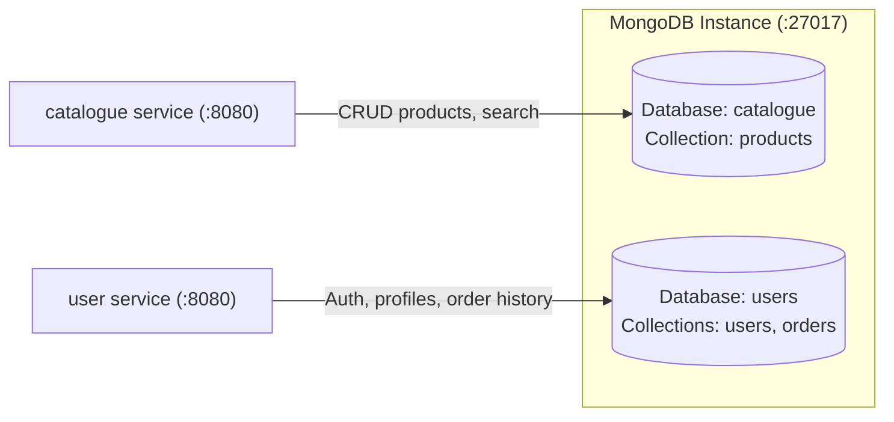

# MongoDB Data Component

The **MongoDB** component provides NoSQL document storage for Stan's Robot Shop (Tier 3: Data Tier). It comes with initialization scripts that automatically seed product catalog records, text indexes, user credentials, and order history structures.

---

## Architecture & Service Connections

MongoDB is queried by the Catalogue and User microservices over the standard MongoDB wire protocol.



---

## Database Schemas & Seed Data

1. **`catalogue` Database**:
   * **Collection**: `products`
   * **Indexes**: Text index on `{name: "text", description: "text"}` and unique index on `{sku: 1}`.
   * **Seed File**: [catalogue.js](file:///Users/ariansar/Downloads/EKS-Three-Tier/three-tier-architecture-demo/mongo/catalogue.js) (populates 11 robot and AI catalog items).

2. **`users` Database**:
   * **Collections**: `users`, `orders`
   * **Indexes**: Unique index on `{name: 1}`.
   * **Seed File**: [users.js](file:///Users/ariansar/Downloads/EKS-Three-Tier/three-tier-architecture-demo/mongo/users.js) (populates initial accounts: `user`, `stan`, `partner-57`).

---

## Upstream Consumers

| Consumer Service | Port | Database Used | Description |
| :--- | :--- | :--- | :--- |
| **`catalogue`** | 27017 | `catalogue` | Product catalog retrieval, SKU lookup, category filtering, search |
| **`user`** | 27017 | `users` | User registration, authentication, and order recording |

---

## How to Run Locally

### Option 1: Build & Run Using the Project Dockerfile (Recommended)
This method automatically executes the seeding scripts inside `/docker-entrypoint-initdb.d/`:

```bash
# 1. Build image with seed scripts
docker build -t rs-mongodb .

# 2. Run MongoDB container
docker run -d --name mongodb -p 27017:27017 rs-mongodb
```

### Option 2: Mount Scripts into Official MongoDB Image
```bash
docker run -d --name mongodb -p 27017:27017 \
  -v $(pwd):/docker-entrypoint-initdb.d \
  mongo:5
```

---

## How to Test & Verify

1. **Verify Mongo Daemon Connectivity**:
   ```bash
   docker exec -it mongodb mongosh --eval "db.adminCommand('ping')"
   ```
   **Expected Output:** `{ ok: 1 }`

2. **Verify Catalogue Products**:
   ```bash
   docker exec -it mongodb mongosh catalogue --eval "db.products.countDocuments()"
   ```
   **Expected Output:** `11`

3. **Verify Seeded Users**:
   ```bash
   docker exec -it mongodb mongosh users --eval "db.users.find({}, {name: 1, email: 1, _id: 0})"
   ```
   **Expected Output:** Lists the seeded demo users (`user`, `stan`, `partner-57`).
