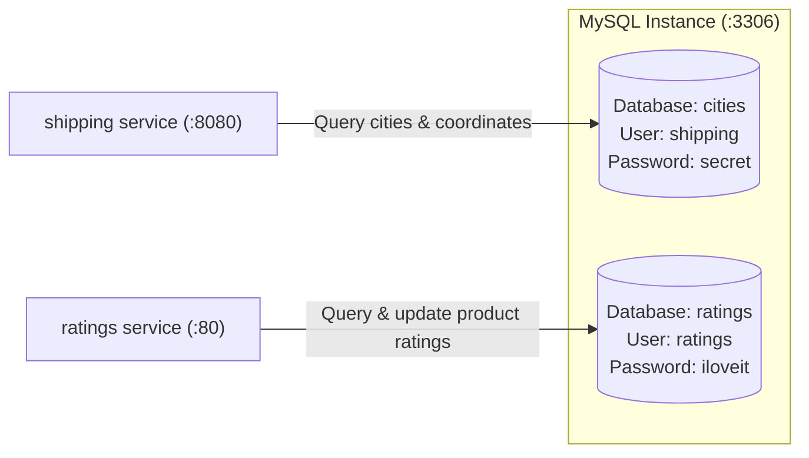

# MySQL Data Component

The **MySQL** component provides relational database storage for Stan's Robot Shop (Tier 3: Data Tier). It hosts two independent databases:
1. **`cities`**: Used by the Shipping service to calculate geographic distance and delivery costs.
2. **`ratings`**: Used by the Ratings service to persist customer star ratings and average scores.

---

## Architecture & Service Connections

MySQL accepts standard TCP connections on port 3306 from the Shipping and Ratings microservices.



---

## Database Details & Credentials

| Database | Dedicated User | Password | Seed Script | Primary Tables |
| :--- | :--- | :--- | :--- | :--- |
| **`cities`** | `shipping` | `secret` | [10-dump.sql.gz](file:///Users/ariansar/Downloads/EKS-Three-Tier/three-tier-architecture-demo/mysql/scripts/10-dump.sql.gz) | `cities`, `codes` |
| **`ratings`** | `ratings` | `iloveit` | [20-ratings.sql](file:///Users/ariansar/Downloads/EKS-Three-Tier/three-tier-architecture-demo/mysql/scripts/20-ratings.sql) | `ratings` |

*Note: Root access is configured with `MYSQL_ALLOW_EMPTY_PASSWORD=yes` for local development.*

---

## Upstream Consumers

| Consumer Service | Port | Database Used | Description |
| :--- | :--- | :--- | :--- |
| **`shipping`** | 3306 | `cities` | Looks up country codes, city coordinates (latitude/longitude), and matches city names |
| **`ratings`** | 3306 | `ratings` | Reads and updates average ratings and review counts by SKU |

---

## How to Run Locally

### Option 1: Build & Run Using Project Dockerfile (Recommended)
This method executes the schema creation and data import automatically:

```bash
# 1. Build image
docker build -t rs-mysql-db .

# 2. Run MySQL container
docker run -d --name mysql -p 3306:3306 rs-mysql-db
```

### Option 2: Mount Scripts into Official MySQL 5.7 Image
```bash
docker run -d --name mysql -p 3306:3306 \
  -e MYSQL_ALLOW_EMPTY_PASSWORD=yes \
  -e MYSQL_DATABASE=cities \
  -e MYSQL_USER=shipping \
  -e MYSQL_PASSWORD=secret \
  -v $(pwd)/scripts:/docker-entrypoint-initdb.d \
  mysql:5.7
```

---

## How to Test & Verify

1. **Verify MySQL Readiness**:
   ```bash
   docker exec -it mysql mysqladmin ping -u root
   ```
   **Expected Output:** `mysqld is alive`

2. **Verify `cities` Database**:
   ```bash
   docker exec -it mysql mysql -ushipping -psecret -e "SELECT count(*) FROM cities.cities;"
   ```
   **Expected Output:** A count of approximately `28828` records.

3. **Verify `ratings` Database**:
   ```bash
   docker exec -it mysql mysql -uratings -piloveit -e "SHOW TABLES FROM ratings;"
   ```
   **Expected Output:**
   ```text
   +-------------------+
   | Tables_in_ratings |
   +-------------------+
   | ratings           |
   +-------------------+
   ```
