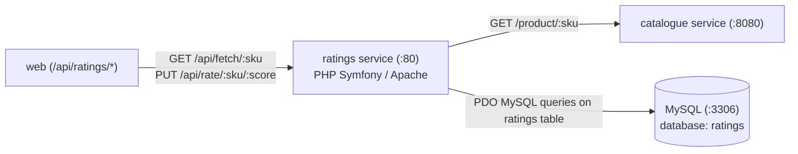

# Ratings Microservice

The **Ratings** microservice manages product reviews and average rating scores (1 to 5 stars). It is implemented in **PHP 7.4** with the **Symfony MicroKernel** running under Apache, backed by **MySQL**.

---

## Architecture & Service Connections

The Ratings service is in the Application Tier (Tier 2). It validates that a product exists by making an HTTP call to the Catalogue service before storing or updating ratings in MySQL.



---

## Upstream & Downstream Dependencies

| Connection | Direction | Protocol | Description |
| :--- | :--- | :--- | :--- |
| **`web`** | Inbound | HTTP / REST | Proxies browser requests to view or post product star ratings |
| **`catalogue`** | Outbound | HTTP / REST | Validates that the target SKU exists before accepting new ratings |
| **`mysql`** | Outbound | PDO / MySQL | Reads and updates average ratings and vote counts in `ratings` table |

---

## Environment Variables

| Variable | Default Value | Description |
| :--- | :--- | :--- |
| `PDO_URL` | `mysql:host=mysql;dbname=ratings;charset=utf8mb4` | PDO connection string for MySQL |
| `CATALOGUE_URL` | `http://catalogue:8080` | URL endpoint for the Catalogue service |
| `APP_ENV` | `prod` | Symfony environment (`prod` or `dev`) |

---

## Database Credentials

* **Database**: `ratings`
* **Username**: `ratings`
* **Password**: `iloveit`

---

## How to Run Locally

### 1. Start Backing Services (MySQL & Catalogue)
```bash
# 1. Run MySQL container containing the ratings database
docker build -t rs-mysql-db ../mysql
docker run -d --name mysql -p 3306:3306 rs-mysql-db

# 2. (Optional) Run Catalogue container
docker run -d --name catalogue -p 8080:8080 -e MONGO_URL=mongodb://host.docker.internal:27017/catalogue rs-catalogue
```

### 2. Run with Docker (Recommended)
*Requirements: Docker*

```bash
# 1. Build Docker image
docker build -t rs-ratings .

# 2. Run container
docker run -d --name ratings -p 8000:80 \
  -e PDO_URL="mysql:host=host.docker.internal;dbname=ratings;charset=utf8mb4" \
  -e CATALOGUE_URL="http://host.docker.internal:8080" \
  rs-ratings
```

---

## How to Test & Verify

1. **Health Check Endpoint**:
   ```bash
   curl -s http://localhost:8000/_health
   ```
   **Expected Output:**
   ```json
   {"app":"OK"}
   ```

2. **Submit a Rating for a Product (1-5)**:
   *(Requires Catalogue running with SKU `Watson`)*
   ```bash
   curl -s -X PUT http://localhost:8000/api/rate/Watson/5
   ```
   **Expected Output:**
   ```json
   {"success":true}
   ```

3. **Fetch Rating Summary for a Product**:
   ```bash
   curl -s http://localhost:8000/api/fetch/Watson
   ```
   **Expected Output:**
   ```json
   {
     "sku": "Watson",
     "avg_rating": 5.0,
     "rating_count": 1
   }
   ```
