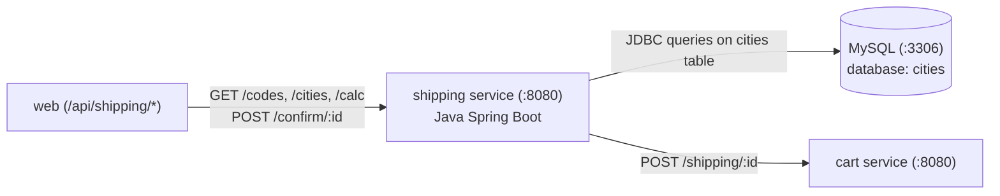

# Shipping Microservice

The **Shipping** microservice calculates shipping rates, handles geographic distance lookups for delivery destinations, and commits shipping charges to active shopping carts. It is built with **Java (Spring Boot)** and uses **MySQL** to look up geographic coordinates.

---

## Architecture & Service Connections

The Shipping service is in the Application Tier (Tier 2). It reads destination city coordinates from MySQL and calls the Cart service to record the calculated shipping fee.



---

## Upstream & Downstream Dependencies

| Connection | Direction | Protocol | Description |
| :--- | :--- | :--- | :--- |
| **`web`** | Inbound | HTTP / REST | Queries country codes, cities autocomplete, and initiates shipping calculation |
| **`mysql`** | Outbound | JDBC / MySQL | Reads world cities coordinates (latitude/longitude) from `cities` database |
| **`cart`** | Outbound | HTTP / REST | Calls `POST /shipping/{id}` to append delivery fee to customer cart |

---

## Environment Variables

| Variable | Default Value | Description |
| :--- | :--- | :--- |
| `DB_HOST` | `mysql` | Hostname/DNS of the MySQL server |
| `CART_ENDPOINT` | `cart:8080` | Host and port of the Cart service |

---

## Database Credentials

* **Database**: `cities`
* **Username**: `shipping`
* **Password**: `secret`

---

## How to Run Locally

### 1. Start Backing Database (MySQL)
The shipping service requires the pre-populated MySQL `cities` database:
```bash
# Build and run the project's MySQL container
docker build -t rs-mysql-db ../mysql
docker run -d --name mysql -p 3306:3306 rs-mysql-db
```

### 2. Option A: Run Natively with Maven & Java
*Requirements: Java 8 (or 11) JDK and Maven 3.x*

```bash
# 1. Build the application jar
mvn clean package

# 2. Run the application
DB_HOST=localhost CART_ENDPOINT=localhost:8080 java -jar target/shipping-1.0.jar
```

### 3. Option B: Run with Docker
```bash
# 1. Build Docker image (multi-stage Maven build)
docker build -t rs-shipping .

# 2. Run container
docker run -d --name shipping -p 8080:8080 \
  -e DB_HOST=host.docker.internal \
  -e CART_ENDPOINT=host.docker.internal:8080 \
  rs-shipping
```

---

## How to Test & Verify

1. **Health Check Endpoint**:
   ```bash
   curl -s http://localhost:8080/health
   ```
   **Expected Output:** `OK`

2. **Total Cities Count in Database**:
   ```bash
   curl -s http://localhost:8080/count
   ```
   **Expected Output:** Numeric count of cities in the database (e.g. `28828`).

3. **Get Available Country Codes**:
   ```bash
   curl -s http://localhost:8080/codes
   ```
   **Expected Output:** JSON list of country codes (e.g., `[{"code":"US","name":"United States"}, ...]`).

4. **Calculate Shipping Cost for a City**:
   ```bash
   curl -s http://localhost:8080/calc/100
   ```
   **Expected Output:**
   ```json
   {
     "distance": 8450,
     "cost": 422.5
   }
   ```

5. **Confirm Shipping to Cart**:
   *(Requires cart service running)*
   ```bash
   curl -s -X POST http://localhost:8080/confirm/cart-123 \
     -H "Content-Type: application/json" \
     -d '{"distance": 8450, "cost": 422.5}'
   ```
