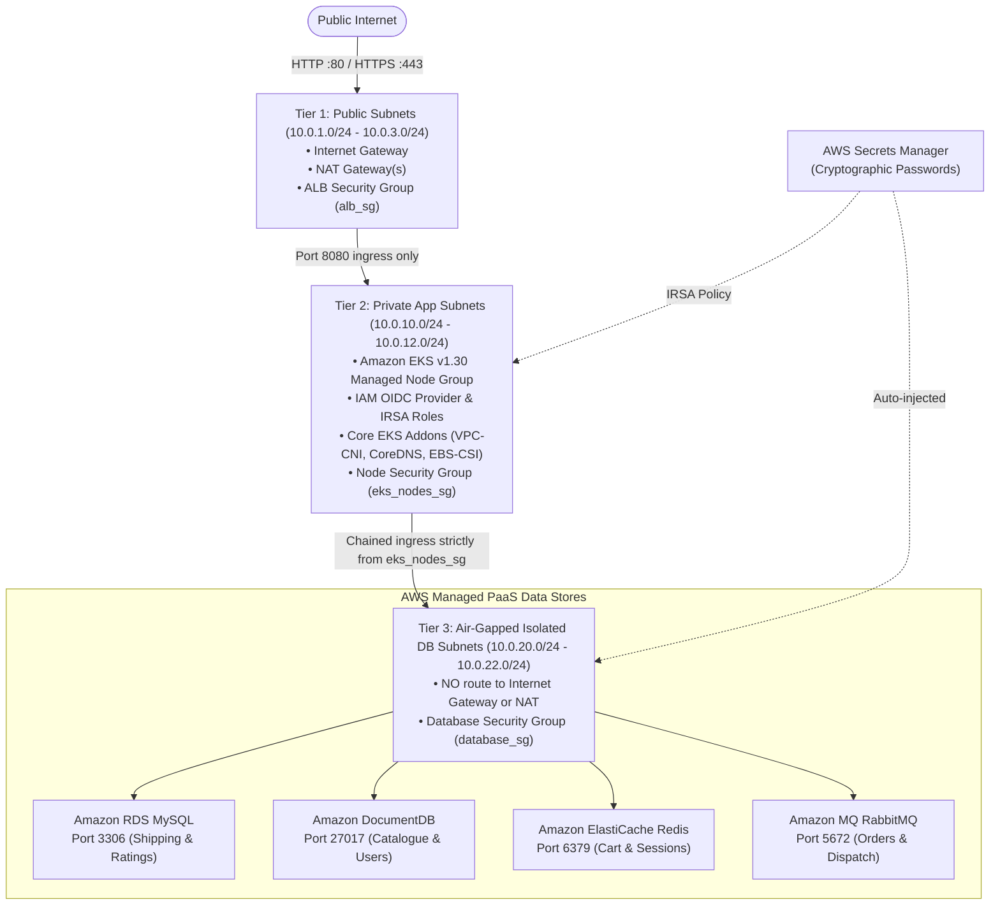

# AWS 3-Tier Microservices Infrastructure (Terraform)

Production-grade, modular AWS infrastructure provisioning for the **Robot Shop 3-Tier Microservices Application** using 100% Terraform / OpenTofu.

---

## 🏛️ Architecture Overview

The infrastructure strictly adheres to the **AWS Well-Architected Framework** with network segmentation across 3 Availability Zones and zero direct database exposure:



---

## 📁 Repository & Directory Layout

```text
terraform/
├── README.md                   # This documentation
├── versions.tf                 # Terraform CLI & required provider constraints
├── providers.tf                # AWS provider configuration & default tags
├── variables.tf                # Global input variables (CIDR, regions, instances)
├── outputs.tf                  # Root exports (VPC, Subnets, Secrets ARN, DB & EKS endpoints)
├── main.tf                     # Root orchestrator connecting all modules
│
├── environments/
│   ├── dev.tfvars              # Cost-optimized / Free-Tier configuration (Single NAT, t3.micro)
│   └── prod.tfvars             # Multi-AZ HA configuration (3 NATs, Multi-AZ RDS, 3-node DocDB)
│
└── modules/
    ├── vpc/                    # Stage 1: 3-Tier Multi-AZ VPC, subnets, IGW, NAT, and route tables
    ├── security_groups/        # Stage 2: Least-privilege firewalls (alb_sg -> eks_sg -> db_sg)
    ├── secrets/                # Stage 3: AWS Secrets Manager & random_password generation
    ├── databases/              # Stage 4: AWS Managed RDS, DocumentDB, ElastiCache, Amazon MQ
    └── eks/                    # Stage 5: Amazon EKS v1.36 cluster, worker nodes, OIDC, IRSA, addons
```

---

## 🧩 Module Breakdown

| Stage | Module | Description | Key Resources |
|---|---|---|---|
| **1** | [`modules/vpc`](./modules/vpc) | 3-Tier Multi-AZ Networking (`10.0.0.0/16`) | 1 VPC, 9 Subnets (3 Public, 3 Private, 3 Isolated), 1 Internet Gateway, Dynamic NAT Gateways (1 in dev, 3 in prod), 3 Route Tables, DB Subnet Groups. |
| **2** | [`modules/security_groups`](./modules/security_groups) | Least-Privilege Network Firewalls | `alb_sg` (80/443 ingress), `eks_nodes_sg` (8080 from ALB only, self intra-cluster), `database_sg` (3306, 27017, 6379, 5672 strictly from `eks_nodes_sg`). |
| **3** | [`modules/secrets`](./modules/secrets) | Credentials Management | `random_password` (20+ chars, special characters excluded to avoid URI parsing bugs), AWS Secrets Manager vault storing JSON payload for all PaaS data stores. |
| **4** | [`modules/databases`](./modules/databases) | AWS Managed PaaS Data Stores | Amazon RDS MySQL (8.0), Amazon DocumentDB (5.0), Amazon ElastiCache Redis (7.0), Amazon MQ RabbitMQ (4.2 on Graviton `mq.m7g.large`) in air-gapped subnets. |
| **5** | [`modules/eks`](./modules/eks) | Kubernetes Compute & IAM | Amazon EKS Cluster v1.36, Private Managed Worker Node Group (`t3.large` dev / `m6i.large` prod), OIDC Provider, IRSA IAM roles (ALB Controller, Secrets Store CSI, EBS CSI Driver), EKS addons (`vpc-cni`, `coredns`, `kube-proxy`, `aws-ebs-csi-driver`). |

---

## ⚙️ Environments Comparison

| Configuration | Development (`dev.tfvars`) | Production (`prod.tfvars`) | Rationale / Benefits |
|---|---|---|---|
| **Kubernetes Version** | `1.36` | `1.36` | Latest active AWS EKS Standard Support version. |
| **NAT Gateways** | 1 (Shared across private subnets) | 3 (1 per AZ for high availability) | Saves ~$65/mo in dev while ensuring full multi-AZ HA in prod. |
| **RDS MySQL** | Single-AZ `db.t3.micro` (Free-Tier eligible) | Multi-AZ `db.m6i.large` standby failover | 6th-gen Intel Ice Lake compute with zero downtime failover. |
| **DocumentDB** | 1 instance `db.t3.medium` (30-day trial eligible) | 3 instances `db.r6g.large` cluster | Memory-optimized Graviton architecture. |
| **ElastiCache Redis** | Single-node `cache.t3.micro` (Free-Tier eligible) | Multi-AZ `cache.m6g.large` replication group | Graviton price-performance standard with auto-failover. |
| **Amazon MQ (RabbitMQ)** | Single-broker `mq.m7g.large` (RabbitMQ 4.2) | Clustered Multi-AZ `mq.m7g.large` (RabbitMQ 4.2) | Modern Graviton instance with EBS storage; avoids deprecated `mq.t3.micro`. |
| **EKS Worker Nodes** | 2 &times; `t3.large` (Min 1, Max 3) | 3 &times; `["m6i.large", "m7i.large"]` (Min 3, Max 8) | Dev avoids the 17-pod limit; prod uses multi-family 6th/7th-gen pools. |

---

## 🚀 Quickstart & Usage

### 1. Prerequisites
* **Terraform** $\ge$ 1.5.0 (or OpenTofu $\ge$ 1.6.0)
* **AWS CLI** v2 configured with adequate IAM permissions:
  ```bash
  aws sts get-caller-identity
  ```

### 2. Initialize Terraform
```bash
terraform init
```

### 3. Select or Create Workspace
```bash
# For Development
terraform workspace new dev || terraform workspace select dev

# For Production
terraform workspace new prod || terraform workspace select prod
```

### 4. Validate Configuration
```bash
terraform validate
```

### 5. Generate Execution Plan (Dry Run)
```bash
terraform plan -var-file=environments/dev.tfvars
```

### 6. Apply Infrastructure
```bash
terraform apply -var-file=environments/dev.tfvars
```

---

## 🔒 Security Best Practices Implemented

1. **Air-Gapped Databases**:
   * Tier 3 subnets have no default route (`0.0.0.0/0`) to the Internet Gateway or to NAT Gateways. Database instances cannot reach or be reached by the public internet.
2. **Zero Hardcoded Passwords**:
   * All database passwords are cryptographically generated during provisioning and stored securely inside AWS Secrets Manager.
3. **Chained Security Groups**:
   * Databases only accept connections originating from the worker nodes' security group (`eks_nodes_sg`), preventing unauthorized lateral movement.
4. **IAM Roles for Service Accounts (IRSA)**:
   * Uses OIDC authentication so pods assume fine-grained IAM roles without permanent AWS access keys or node-level over-permissioning.
5. **Private Worker Nodes**:
   * EKS worker nodes are placed exclusively in Tier 2 Private App subnets without public IPv4 addresses.

---

## 🧹 Teardown (Clean Destroy)

To tear down all provisioned AWS resources and avoid ongoing charges:

```bash
terraform destroy -var-file=environments/dev.tfvars
```
