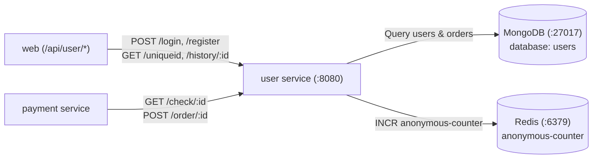

# User Microservice

The **User** microservice handles authentication, user registration, profile management, and order history tracking. It also tracks anonymous visitors by utilizing Redis counters.

---

## Architecture & Service Connections

The User service is in the Application Tier (Tier 2). It integrates with MongoDB to persist user credentials and historical orders, and Redis for tracking anonymous visitors.



---

## Upstream & Downstream Dependencies

| Connection | Direction | Protocol | Description |
| :--- | :--- | :--- | :--- |
| **`web`** | Inbound | HTTP / REST | Handles customer registration, login, and order history viewing |
| **`payment`** | Inbound | HTTP / REST | Checks user validity before checkout and appends completed orders to user history |
| **`mongodb`** | Outbound | MongoDB Wire Protocol | Stores collections: `users` (credentials) and `orders` (purchased items) |
| **`redis`** | Outbound | Redis RESP Protocol | Generates sequential anonymous session IDs via atomic `INCR` |

---

## Environment Variables

| Variable | Default Value | Description |
| :--- | :--- | :--- |
| `MONGO_URL` | `mongodb://mongodb:27017/users` | MongoDB connection connection string |
| `REDIS_HOST` | `redis` | Hostname/DNS of the Redis instance |
| `USER_SERVER_PORT` | `8080` | Port for the Express server to listen on |

---

## How to Run Locally

### 1. Start Backing Services (MongoDB & Redis)
```bash
# 1. Run MongoDB with pre-populated users data
docker run -d --name mongodb -p 27017:27017 -v $(pwd)/../mongo:/docker-entrypoint-initdb.d mongo:5

# 2. Run Redis
docker run -d --name redis -p 6379:6379 redis:6.2-alpine
```

### 2. Option A: Run Natively with Node.js
*Requirements: Node.js 14+ and npm*

```bash
# 1. Install dependencies
npm install

# 2. Start the service
MONGO_URL=mongodb://localhost:27017/users REDIS_HOST=localhost npm start
```

### 3. Option B: Run with Docker
```bash
# 1. Build the Docker image
docker build -t rs-user .

# 2. Run container connected to host's MongoDB and Redis
docker run -d --name user -p 8080:8080 \
  -e MONGO_URL=mongodb://host.docker.internal:27017/users \
  -e REDIS_HOST=host.docker.internal \
  rs-user
```

---

## How to Test & Verify

1. **Health Check Endpoint**:
   ```bash
   curl -s http://localhost:8080/health
   ```
   **Expected Output:**
   ```json
   {"app":"OK","mongo":true}
   ```

2. **Generate Unique Anonymous Visitor ID**:
   ```bash
   curl -s http://localhost:8080/uniqueid
   ```
   **Expected Output:**
   ```json
   {"uuid":"anonymous-1"}
   ```

3. **Check Existing User (Seeded in DB)**:
   ```bash
   curl -s -o /dev/null -w "%{http_code}\n" http://localhost:8080/check/user
   ```
   **Expected Output:** `200`

4. **Authenticate User (Login)**:
   ```bash
   curl -s -X POST http://localhost:8080/login \
     -H "Content-Type: application/json" \
     -d '{"name":"user", "password":"password"}'
   ```
   **Expected Output:** Returns the user document with name and email.

5. **Register New User**:
   ```bash
   curl -s -X POST http://localhost:8080/register \
     -H "Content-Type: application/json" \
     -d '{"name":"alice", "password":"secretpassword", "email":"alice@example.com"}'
   ```
   **Expected Output:** `OK`
