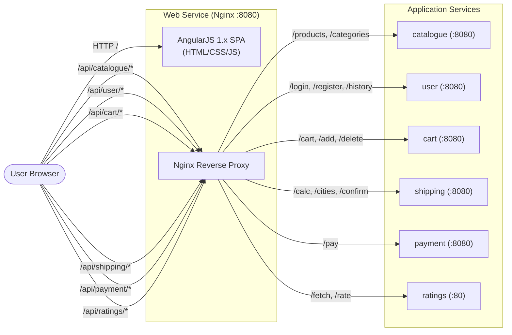

# Web Frontend & Reverse Proxy Microservice

The **Web** microservice serves as the single public entry point (Tier 1: Presentation Tier) for Stan's Robot Shop. It bundles the client-side single-page application (SPA) with an Nginx reverse proxy that routes incoming API traffic to downstream backend microservices.

---

## Architecture & Service Connections

The Web microservice hosts the static web application and acts as an API gateway, proxying HTTP traffic based on URI paths to internal backend services.



---

## Upstream & Downstream Dependencies

| Dependency | Protocol | Destination Port | Description |
| :--- | :--- | :--- | :--- |
| **`catalogue`** | HTTP | `8080` | Product catalog retrieval and search |
| **`user`** | HTTP | `8080` | User authentication, registration, order history |
| **`cart`** | HTTP | `8080` | Add/view/modify items in user shopping carts |
| **`shipping`** | HTTP | `8080` | City lookup and delivery cost calculations |
| **`payment`** | HTTP | `8080` | Order checkout and payment transactions |
| **`ratings`** | HTTP | `80` | Product review lookup and star submissions |

---

## Environment Variables

| Variable | Default Value | Description |
| :--- | :--- | :--- |
| `CATALOGUE_HOST` | `catalogue` | Hostname/DNS of the Catalogue service |
| `USER_HOST` | `user` | Hostname/DNS of the User service |
| `CART_HOST` | `cart` | Hostname/DNS of the Cart service |
| `SHIPPING_HOST` | `shipping` | Hostname/DNS of the Shipping service |
| `PAYMENT_HOST` | `payment` | Hostname/DNS of the Payment service |
| `RATINGS_HOST` | `ratings` | Hostname/DNS of the Ratings service |
| `INSTANA_EUM_KEY` | *(optional)* | Instana End-User Monitoring Key |
| `INSTANA_EUM_REPORTING_URL` | *(optional)* | Instana EUM reporting endpoint URL |

---

## How to Run Locally

### Option 1: Using Docker (Recommended)

1. Build the Docker image:
   ```bash
   docker build -t rs-web .
   ```

2. Run the container:
   ```bash
   docker run -d --name web -p 8080:8080 rs-web
   ```

   *Note: If you have local backend services running on your host machine, map the hostnames using `--add-host` or environment variables:*
   ```bash
   docker run -d --name web \
     -p 8080:8080 \
     -e CATALOGUE_HOST=host.docker.internal \
     -e USER_HOST=host.docker.internal \
     -e CART_HOST=host.docker.internal \
     -e SHIPPING_HOST=host.docker.internal \
     -e PAYMENT_HOST=host.docker.internal \
     -e RATINGS_HOST=host.docker.internal \
     rs-web
   ```

---

## How to Test & Verify

1. **Verify UI Availability**:
   Open your browser to:
   ```text
   http://localhost:8080
   ```
   Or run a `curl` command:
   ```bash
   curl -I http://localhost:8080/
   ```
   **Expected Output:** HTTP status `200 OK`.

2. **Verify Nginx Status Endpoint**:
   ```bash
   curl http://localhost:8080/nginx_status
   ```
   **Expected Output:**
   ```text
   Active connections: 1 
   server accepts handled requests
    1 1 1 
   Reading: 0 Writing: 1 Waiting: 0 
   ```

3. **Verify API Proxying**:
   If the `catalogue` service is running:
   ```bash
   curl -s http://localhost:8080/api/catalogue/categories
   ```
